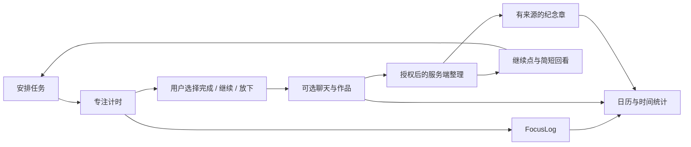

# 项目结构与工作方式

## 从任务到足迹

用户安排任务后进入专注计时。有效时间写入 FocusLog；完成、继续和放下由用户选择，独立于计时记录。聊天与作品可以关联任务和日期，再用于接续对话、当天回看和有来源的纪念章。

## 主要代码

| 路径 | 职责 |
| --- | --- |
| `src/Prototype.tsx`、`src/prototype.css` | 今日、足迹、我的，以及页面视觉和交互 |
| `src/Companion.tsx`、`src/companionApi.ts` | 小芽对话、授权、附件和服务端同步 |
| `src/GettingStarted.tsx` | 实际页面上的蒙层互动教程 |
| `src/dailyActivity.ts`、`src/TaskTimeStats.tsx` | 日期时长、正在进行的投入、分类时间图表 |
| `src/stampBook.ts`、`src/stampDefinitions.ts` | 数据兼容、统一印章说明与获得依据 |
| `src/StampCollection.tsx`、`src/CalendarStamp.tsx` | 印章册、详情与日历图案 |
| `src/ProductSheet.tsx`、`src/useNativeViewport.ts` | 产品弹层与真实手机键盘适配 |
| `server/companion.mjs`、`server/service.mjs` | 聊天记忆、模型请求、识图和绘图 |
| `server/index.mjs`、`server/production.mjs` | API、来源校验与生产静态资源服务 |
| `src/mobile/`、`mobile-runtime.lock.json` | 设备预览运行时与完整性检查 |
| `db/`、`drizzle/`、`shared/` | 数据定义、迁移及共享规则 |
| `tests/` | 状态一致性、输入弹层、日历点击、模型和部署检查 |

## 保留数据与独立运行

本机记录与基本操作立即保存，不等待模型。服务端后台任务异步补充内容，按事件去重；失败不会撤销任务、计时或作品保存。原有迁移、FocusLog 和 `jixiang` 存储标识继续保留。

浏览器不持有模型密钥。公网服务按随机浏览器令牌隔离记忆，并限制接口来源；作品原件主要保存在浏览器，授权后只发送所需内容。后台整理不会自行修改用户计划或对外分享。
